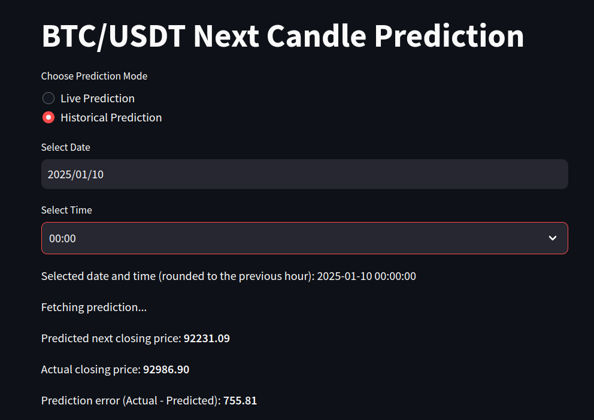
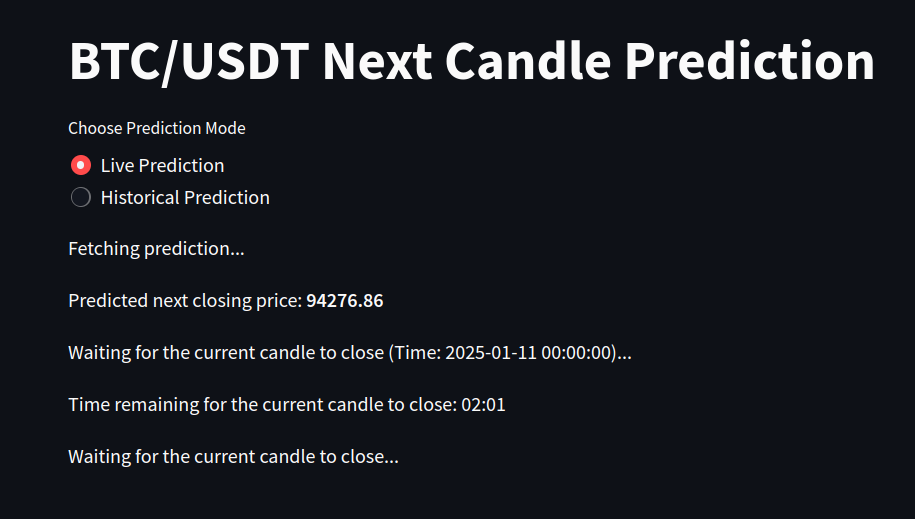
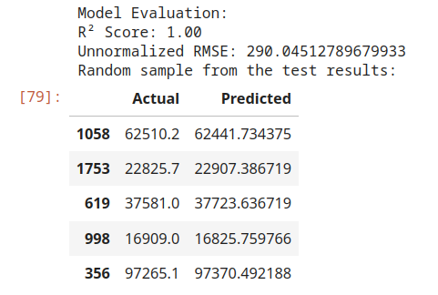

# BTC/USDT Next Candle Prediction

## Overview

 In this project, I built a model to predict the next closing price of the BTC/USDT trading pair on Binance using historical candlestick data. The model uses **XGBoost regression**, and incorporates key technical indicators to predict price movement. The goal is to predict the closing price of the next candle based on real-time data and technical analysis features such as **EMA (Exponential Moving Average**), **RSI (Relative StrengthIndex)**, **MACD (Moving Average Convergence Divergence)**, and **Bollinger Bands**.
 
The model is evaluated with standard metrics like **Mean Squared Error (MSE)** and **Root Mean Squared Error (RMSE)**, allowing us to assess its accuracy in predicting future prices. Additionally, the model is deployed in a web application, where predictions can be made on historical data or in live prediction mode.

## Requirements

Install dependencies using:

```bash
pip install -r requirements.txt
```

## Project Structure

- [`predict.py`](./predict.py): Contains the logic for data preprocessing, feature calculation, and model prediction.
- [`app.py`](./app.py): Streamlit-based web interface for input and displaying predictions.
- [`./data/scaling_params.json`](./data/scaling_params.json): Contains the mean and standard deviation values used to normalize/unnormalize the features.
- [`xgb_model.pkl`](./xgb_model.pkl): Saved XGBoost model for predicting the next closing price.
- [`./data/test_results.csv`](./data/test_results.csv): CSV file that stores the actual vs predicted prices and associated error metrics.
- [`/notebooks`](./notebooks): This folder contains the Jupyter notebooks with code used to fetch, clean and preprocess the data and train the model.

## Usage

### 1. Setup Environment
- Make sure you have the necessary environment variables set for the Binance API keys (`BINANCE_API_KEY` and `BINANCE_SECRET_KEY`).
- Clone the repository and install the required dependencies.

### 2. Running the Application
To run the Streamlit web interface for predictions, use:

```bash
streamlit run app.py
```

### 3. Making Predictions

- **Past Prediction Mode**: You can input a specific timestamp (date and hour) to predict the next closing price of the BTC/USDT trading pair.



- **Live Prediction Mode**: Automatically updates predictions as new candles close. You will see the predicted price and the error once the candle closes.
 



 ## How the App Works
 
 1. **Data Fetching**: The app fetches the latest 100 candlesticks (OHLCV data) for the BTC/USDT trading pair via the Binance API.
 2. **Feature Calculation**: It computes the selected technical indicators (EMA, RSI, MACD, Bollinger Bands) based on the fetched data.
 3. **Prediction**: The processed features are passed into the trained XGBoost model, which predicts the next closing price of BTC/USDT.
 4. **Scaling and Unnormalizing**: The model’s inputs are normalized, and after prediction, the outputs are unnormalized to return the predicted price in the same scale as the input data.
 5. **Error Calculation**: After making predictions, the error is computed by comparing the predicted price with the actual price from the last candle.

## The Model Building Process
 
 ### 1. Data Collection
 I fetched historical OHLCV (Open, High, Low, Close, Volume) data for BTC/USDT using the Binance API. I opted for hourly candles because predicting on shorter time intervals like minutes or seconds introduces noise that the model could struggle with. The use of hourly candles provides sufficient granularity while avoiding excessive fluctuations.
 
 ### 2. Feature Engineering
 The core idea behind predicting future prices lies in technical analysis. I selected a set of widely-used indicators to capture the price trends and market sentiment. Here's why I chose each one:
 
 - **Exponential Moving Average (EMA)**: I used EMA to capture the trend over different time horizons (e.g., 5-hour, 20-hour). The EMA is sensitive to recent price changes, which is crucial for cryptocurrency markets where trends can change rapidly.
 - **Relative Strength Index (RSI)**: RSI helps to understand overbought or oversold conditions, offering insights into whether an asset is overvalued or undervalued.
 - **Moving Average Convergence Divergence (MACD)**: MACD helps identify the strength, direction, and momentum of a trend, making it a reliable indicator for trend-following strategies.
 - **Bollinger Bands**: Bollinger Bands help measure volatility and can indicate whether the asset is in a period of consolidation or expanding volatility.
 - **Time Based Parameters**: Month, day of week and time can capture time related trends 
 
 ### 3. Model Selection: XGBoost
 I chose XGBoost as the model for this task because it is an extremely powerful and efficient machine learning algorithm. XGBoost is based on gradient boosting, which builds a series of decision trees that learn to predict residuals from previous trees. This approach helps to improve prediction accuracy over time.
 
 The reasons for using XGBoost include:
 
 - **High Accuracy**: XGBoost is known for providing state-of-the-art results for regression tasks.
 - **Complex Trends**: Gradient boosted trees can model complex relationships between the parameters
 - **Handling Missing Data**: XGBoost automatically handles missing data, reducing the need for extensive data cleaning.
 - **Feature Importance**: It allows me to easily identify which features are most important in making predictions.
 
 ### 4. Data Preprocessing and Scaling
 Before feeding the data into the model, I normalized the features using scaling techniques to ensure that the model treats all features equally. I used StandardScaler to standardize the data (i.e., mean of 0 and standard deviation of 1). After training, the model’s predictions were then unnormalized using the scaling parameters stored in a JSON file, ensuring that the results were in the correct scale for actual price prediction.
 
 ### 5. Model Training
 I trained the XGBoost regression model on the preprocessed data, using historical features derived from technical indicators and the actual closing prices as the target variable. During training, I employed cross-validation to fine-tune the model’s hyperparameters and ensure the model generalizes well on unseen data.
 
 ### 6. Evaluation and Error Metrics
 The performance of the model was evaluated using standard metrics.



 
 The RMSE of approximately $290.04 means the model’s predictions are, on average, off by $290.04 from the actual BTC/USDT closing price.

 
 The R^2 score explains how much variance in the target variable (price) is captured by the model. A value of 1 means the model explains 100% of the variance, which is excellent. This indicates that the model is perfectly fitting the data, which rarely happens in real-world scenarios but would be ideal.


## License

This project is open-source and available under the [MIT License](https://opensource.org/licenses/MIT).